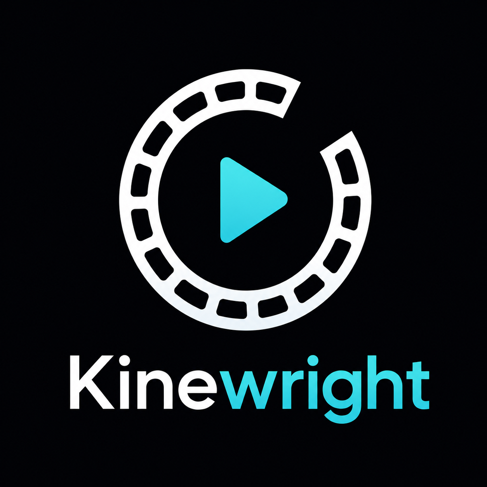
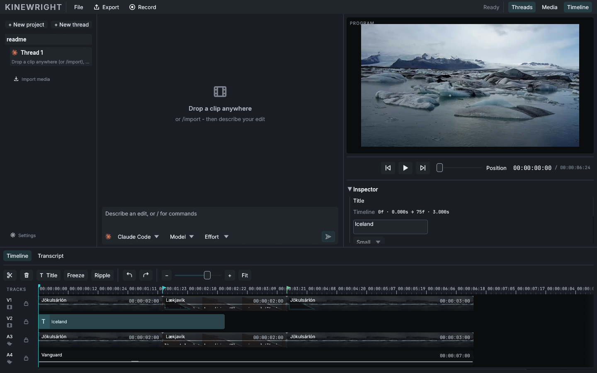

<p align="center">
  
</p>

# Kinewright

**An open-source agentic video editor.** Native on Windows and Linux. Your footage, your subscriptions, your timeline.

[](https://github.com/CanadaApollo6/Kinewright/actions/workflows/ci.yml)
[](LICENSE)
[](docs/BUILDING.md)
[](docs/BUILDING.md)

Kinewright is a **native desktop** video editor written in Rust — the same fast binary on **Windows and Linux**, not a web wrapper, Electron shell, or VM. At its core it is an **agentic harness for video editing**. Type "cut the first three seconds and tighten the pauses" into the chat panel, and the agent CLI you already pay for — Claude Code, Codex, or Cursor — makes the edits on your timeline, using the exact same operations you'd use by hand. Every agent edit lands on the same undo stack as yours: **Ctrl+Z reverses the robot.**

> Early development. The editor works end to end — import, cut, composite, export, agent editing, transcript editing — but expect rough edges.

<p align="center">
  
</p>

<p align="center"><sub>Preview footage: <a href="https://commons.wikimedia.org/wiki/File:Brei%C3%B0armerkurj%C3%B6kull_glacier_lagoon.webm">Breiðarmerkurjökull glacier lagoon</a> by Jason Eppink, <a href="https://creativecommons.org/licenses/by/2.0/">CC BY 2.0</a>; <a href="https://commons.wikimedia.org/wiki/File:Ocean_waves_at_L%C3%A6kjavik_beach,_Iceland.webm">ocean waves at Lækjavik beach</a> by Alexander Grebenkov, <a href="https://creativecommons.org/licenses/by/3.0/">CC BY 3.0</a>. Music: <a href="https://www.scottbuckley.com.au/library/vanguard/">Vanguard</a> by Scott Buckley, <a href="https://creativecommons.org/licenses/by/4.0/">CC BY 4.0</a>.</sub></p>

## What makes it different

- **Native on Windows and Linux.** One Rust desktop app on both platforms — `eframe` / `wgpu` / FFmpeg, not a browser tab. Same editor, same agent harness, same undo stack.
- **Not a video generator.** Models never create footage here. They edit footage *you shot*. The source of truth is your media plus an inspectable edit log — never model output.
- **Bring your own subscription.** Kinewright drives the agent CLIs already installed on your machine (Claude Code, Codex CLI, or Cursor Agent). No API keys to paste, no account, no server, no markup. The CLI handles auth; Kinewright never sees a credential.
- **Human/agent parity by construction.** Every Kinewright mutation — human or agent — is an `Operation` flowing through one core actor. The agent's editing tools are *generated from the operation set*, so it receives the same validated, undoable editing vocabulary as the GUI.
- **Edit by transcript.** Local Whisper transcription (on-device, one-time model download) gives the agent word-level timestamps. "Remove the filler words" becomes a set of precise, frame-accurate cuts.
- **Free forever.** GPLv3. No paid tier, no telemetry, no plans to monetize.

## Features

- Timeline editing: cut, trim, move, split, multi-track, ripple delete/insert with cross-track sync-lock, A/V clip linking, project markers, snapping (markers, cross-track edges, Alt to bypass), filmstrip thumbnails, audio waveforms
- Playback with sample-accurate A/V sync (the audio clock is the master; video never leads) and **multi-track audio mixing that matches the export mixdown to sample-level parity**
- Smooth 4K scrubbing via proxy-resolution preview decode, with performance budgets asserted in tests — and hostile real-world media (VFR phone footage, rotation metadata, HEVC, odd audio) handled by written policy
- Multi-track GPU compositing (wgpu) with effects, crossfades, and **titles as first-class clips** — preview and export share one render path, so what you see is what you export
- Export to H.264/AAC mp4 with progress and cancellation
- Agent editing with senses and plans: transcript, silence, and scene-change inspectors; atomic multi-operation edit plans with a **single undo entry** and one summarized confirmation for anything destructive; plan results self-report remaining dead air so the agent finishes the job
- The agent has *eyes*: it can fetch actual frames from your timeline, not just metadata
- **Measured agent competence**: a scored eval suite (`kinewright-eval`) with an [exact-operation baseline](benchmarks/auto-edit/v1/README.md) and a [finished-cut benchmark](benchmarks/auto-edit/v2/README.md) that renders, probes, hashes, and packages a real MP4 for separate human review — see `docs/EVALS.md`
- The [editorial-truth benchmark](benchmarks/auto-edit/v3/README.md) independently checks rendered speech and exact authored captions; [dialogue-pacing v4](benchmarks/auto-edit/v4/README.md) adds acoustically measured sentence rhythm; the in-progress [generalization v5 gauntlet](benchmarks/auto-edit/v5/README.md) starts testing pinned, licensed real footage
- Context-sensitive inspector panel (clips, titles, markers) driven by the same effect table that validates operations
- Transcript panel with click-word-to-seek
- Crash recovery from an operation journal
- Project save/load (`.kinewright` JSON), keyboard-first editing (J/K/L, I/O, frame stepping — press `?` in-app)

## Getting started

**Requirements**

- **Windows** 10/11, 64-bit, or **Linux** x86_64 (glibc 2.28+) — native desktop apps on both, with bundled FFmpeg
- At least one agent CLI installed and authenticated, if you want agent editing:
  - [Claude Code](https://docs.anthropic.com/en/docs/claude-code/getting-started) (any Claude subscription)
  - [Codex CLI](https://developers.openai.com/codex/cli) 0.147.0+ (ChatGPT subscription)
  - [Cursor Agent CLI](https://docs.cursor.com/en/cli/installation) (Cursor subscription)
- Everything else (FFmpeg, Whisper) is bundled or downloaded automatically

**Install**

Each release publishes a native Windows installer and a native Linux x64 tarball — see [Releases](https://github.com/CanadaApollo6/Kinewright/releases). Manual editing works with no setup; the chat panel lights up automatically when it detects an agent CLI.

**Build from source**

See [docs/BUILDING.md](docs/BUILDING.md) for the full walkthrough.

Windows:

```powershell
git clone https://github.com/CanadaApollo6/Kinewright.git
cd Kinewright
.\scripts\setup-ffmpeg.ps1     # provisions a pinned FFmpeg + build tools locally
cargo build --workspace
cargo run -p kinewright-app
```

Linux:

```bash
git clone https://github.com/CanadaApollo6/Kinewright.git
cd Kinewright
./scripts/install-linux-deps.sh
source ./scripts/setup-ffmpeg.sh   # provisions a pinned FFmpeg 8.x shared GPL build
cargo build --workspace
cargo run -p kinewright-app
```

## How the agent works

Kinewright runs a local MCP (Model Context Protocol) server inside the app and spawns your agent CLI as a subprocess pointed at it. Every session gets the same seven runtime tools, then discovers and loads exact capabilities on demand. The complete generated capability registry stays internal. It has two families:

1. **Edit operations** — plan schemas such as `split_clip`, `trim_clip`, and `add_effect`, auto-generated from the same operation definitions the GUI uses.
2. **Capabilities** — inspectors, planners, proofs, and actions such as timeline summaries, rendered frames, transcripts, analysis, and delivery.

Claude Code and Codex sessions run with their built-in shell/file/web tools disabled or sandboxed away. Cursor receives only the per-project Kinewright MCP endpoint and starts in an empty scratch directory, but its ACP server may still expose Cursor-owned tools; the settings panel states this weaker boundary explicitly. Destructive Kinewright operations pause for your approval in the chat panel. Costs are surfaced when the harness reports them, and turns are capped per session.

Details: [agent harnesses](docs/agent-harnesses.md) · [M36 agent runtime efficiency](docs/M36-AGENT-RUNTIME-EFFICIENCY.md) · [M37 human-acceptable first cut](docs/M37-HUMAN-ACCEPTABLE-FIRST-CUT.md) · [model-first editor](docs/MODEL-FIRST-EDITOR.md) · [current product position](docs/PRODUCT-POSITION-M35-2026-08.md) · [transcription](docs/TRANSCRIPTION.md)

M38: [editorial truth, independent output scoring, and caption correction](docs/M38-EDITORIAL-TRUTH.md). M39: [normalized filler bridges and independently scored dialogue pacing](docs/M39-DIALOGUE-PACING.md). M40: [licensed real-footage generalization across interview, event/multicam, and montage tasks](docs/M40-GENERALIZATION-GAUNTLET.md).

## Architecture

Four crates, two trait boundaries, one message bus:

```
kinewright-core    document model, operations, undo, the Core actor  (pure logic)
kinewright-media   FFmpeg decode/encode, wgpu compositor, audio, Whisper
kinewright-agent   MCP server, tool generation, agent CLI drivers
kinewright-app     the native egui desktop app (Windows and Linux)
```

The full design doc — including why every mutation is an operation, why undo is snapshots, and why the audio callback owns the clock — is [Kinewright-Architecture.md](Kinewright-Architecture.md). The visual language is specified in [docs/DESIGN.md](docs/DESIGN.md).

## Contributing

Contributions are welcome — see [CONTRIBUTING.md](CONTRIBUTING.md) for the build setup, the architectural ground rules (they're short but firm), and how releases work. By contributing you agree your work is licensed under GPLv3; there is no CLA.

## License

[GPL-3.0-only](LICENSE). Kinewright bundles a GPL build of [FFmpeg](https://ffmpeg.org/) (which is why the GPL is a feature here, not a constraint), the [Inter](https://rsms.me/inter/) and [JetBrains Mono](https://www.jetbrains.com/lp/mono/) typefaces (SIL OFL 1.1), and downloads [Whisper](https://github.com/ggerganov/whisper.cpp) models (MIT) on first use.

---

*Kinewright is developed through agentic orchestration — a Claude orchestrator directing Codex implementation agents, with every change reviewed, independently verified, and CI-gated. The tool is built the way it works.*
