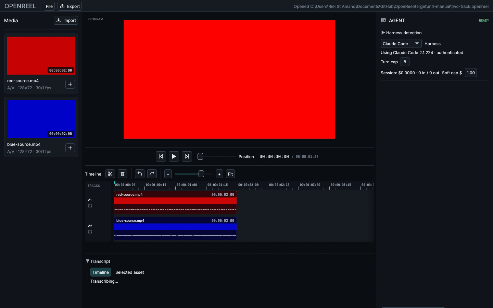

# OpenReel

**An open-source agentic video editor.** Your footage, your subscriptions, your timeline.

[](https://github.com/CanadaApollo6/OpenReel/actions/workflows/ci.yml)
[](LICENSE)

OpenReel is a native Windows video editor written in Rust that is, at its core, an **agentic harness for video editing**. Type "cut the first three seconds and tighten the pauses" into the chat panel, and the agent CLI you already pay for — Claude Code or Codex — makes the edits on your timeline, using the exact same operations you'd use by hand. Every agent edit lands on the same undo stack as yours: **Ctrl+Z reverses the robot.**



> Early development. The editor works end to end — import, cut, composite, export, agent editing, transcript editing — but expect rough edges. The screenshot above uses generated test media; it looks better with your footage.

## What makes it different

- **Not a video generator.** Models never create footage here. They edit footage *you shot*. The source of truth is your media plus an inspectable edit log — never model output.
- **Bring your own subscription.** OpenReel drives the agent CLIs already installed on your machine (Claude Code, Codex CLI). No API keys to paste, no account, no server, no markup. The CLI handles auth; OpenReel never sees a credential.
- **Human/agent parity by construction.** Every mutation — human or agent — is an `Operation` flowing through one core actor. The agent's tools are *generated from the operation set*, so the agent can do exactly what you can do, nothing more, and everything is undoable.
- **Edit by transcript.** Local Whisper transcription (on-device, one-time model download) gives the agent word-level timestamps. "Remove the filler words" becomes a set of precise, frame-accurate cuts.
- **Free forever.** GPLv3. No paid tier, no telemetry, no plans to monetize.

## Features

- Timeline editing: cut, trim, move, split, multi-track, snapping, filmstrip thumbnails, audio waveforms
- Playback with sample-accurate A/V sync (the audio clock is the master; video never leads)
- Multi-track GPU compositing (wgpu) with effects and crossfades — **preview and export share one render path**, so what you see is what you export
- Export to H.264/AAC mp4 with progress and cancellation
- Agent chat panel: streaming responses, tool-call display, per-session cost tracking with a spending cap, confirmation prompts before destructive operations
- The agent has *eyes*: it can fetch actual frames from your timeline, not just metadata
- Transcript panel with click-word-to-seek
- Crash recovery from an operation journal
- Project save/load (`.openreel` JSON), keyboard-first editing (J/K/L, I/O, frame stepping — press `?` in-app)

## Getting started

**Requirements**

- Windows 10/11, 64-bit
- At least one agent CLI installed and authenticated, if you want agent editing:
  - [Claude Code](https://docs.anthropic.com/en/docs/claude-code/getting-started) (any Claude subscription)
  - [Codex CLI](https://developers.openai.com/codex/cli) 0.147.0+ (ChatGPT subscription)
- Everything else (FFmpeg, Whisper) is bundled or downloaded automatically

**Install**

An installer is published with each release — see [Releases](https://github.com/CanadaApollo6/OpenReel/releases). Manual editing works with no setup; the chat panel lights up automatically when it detects an agent CLI.

**Build from source**

See [docs/BUILDING.md](docs/BUILDING.md) for the full walkthrough. Short version:

```powershell
git clone https://github.com/CanadaApollo6/OpenReel.git
cd OpenReel
.\scripts\setup-ffmpeg.ps1     # provisions a pinned FFmpeg + build tools locally
cargo build --workspace
cargo run -p openreel-app
```

## How the agent works

OpenReel runs a local MCP (Model Context Protocol) server inside the app and spawns your agent CLI as a subprocess pointed at it. The agent gets two tool families:

1. **Mutators** — one tool per edit operation (`split_clip`, `trim_clip`, `add_effect`, …), auto-generated from the same operation definitions the GUI uses.
2. **Inspectors** — read-only views: a compact timeline description, individual frames as images, and word-timestamped transcripts.

Sessions are locked down: the agent CLI runs with its built-in shell/file/web tools disabled or sandboxed away — it can edit your timeline and nothing else. Destructive operations (deletes) pause for your approval in the chat panel. Costs are surfaced per turn and capped per session.

Details: [docs/agent-harnesses.md](docs/agent-harnesses.md) · [docs/TRANSCRIPTION.md](docs/TRANSCRIPTION.md)

## Architecture

Four crates, two trait boundaries, one message bus:

```
openreel-core    document model, operations, undo, the Core actor  (pure logic)
openreel-media   FFmpeg decode/encode, wgpu compositor, audio, Whisper
openreel-agent   MCP server, tool generation, agent CLI drivers
openreel-app     the egui application
```

The full design doc — including why every mutation is an operation, why undo is snapshots, and why the audio callback owns the clock — is [OpenReel-Architecture.md](OpenReel-Architecture.md). The visual language is specified in [docs/DESIGN.md](docs/DESIGN.md).

## Contributing

Contributions are welcome — see [CONTRIBUTING.md](CONTRIBUTING.md) for the build setup, the architectural ground rules (they're short but firm), and how releases work. By contributing you agree your work is licensed under GPLv3; there is no CLA.

## License

[GPL-3.0-only](LICENSE). OpenReel bundles a GPL build of [FFmpeg](https://ffmpeg.org/) (which is why the GPL is a feature here, not a constraint), the [Inter](https://rsms.me/inter/) and [JetBrains Mono](https://www.jetbrains.com/lp/mono/) typefaces (SIL OFL 1.1), and downloads [Whisper](https://github.com/ggerganov/whisper.cpp) models (MIT) on first use.

---

*OpenReel is developed through agentic orchestration — a Claude orchestrator directing Codex implementation agents, with every change reviewed, independently verified, and CI-gated. The tool is built the way it works.*
